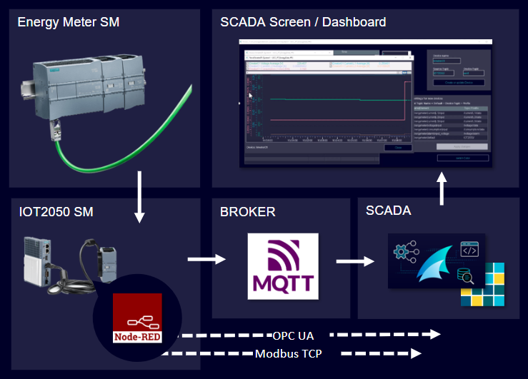

# **IOT2050SM-Energy-Data-Management**

- [**IOT2050SM-Energy-Data-Management**](#iot2050sm-energy-data-management)
  - [**Overview**](#overview)
    - [**Used Components**](#used-components)
    - [**Goal**](#goal)
    - [**Installation and configuration**](#installation-and-configuration)
  - [Contribution and Contribution License Agreement](#contribution-and-contribution-license-agreement)
  - [**Licence and Legal Information**](#licence-and-legal-information)

## **Overview**

**Warning** Hazardous voltage. Will cause death or serious injury!! This application example requires working with 230V and may only be carried out by qualified personnel.

This application describes how collect and manage energy data on an IOT2050SM using a compatible Energy Meter 1238. The performance data will be collected, pre-processed and forwarded to a SCADA system using MQTT.

### **Used Components**

This Example was created using the following Software:

- **On Debian (IOT2050):**
  - Node-Red
  - IOT2050SM WebUI

TBD MARCO SOFTWARE

The Tests were executed on the following Hardware:

- SIMATIC IOT2050SM (6ES7647-0CA00-1AA2)
- SIMATIC SM 1238 Energy Meter 480VAC (6ES7238-5XA32-0XB0)
- 3x ELEQ TQ30 60/1A current transformer

### **Goal**

After working through the following documents, you will know how to:

- Connect and configure an Energy Meter 1238 to the IOT2050SM
- Collect and pre-process energy performance data using Node-Red
- Forward the data to a superior SCADA system using MQTT
- Present and further process the data in SCADA

This documentaion will focus on the IOT2050SM part and will not give deeper insights into setting up the SCADA system.

### **Installation and configuration**

Use the following documents for the configuration of the IOT2050 and S7-1500:

- [Connection and Configuring Energy Meter 1238](docs/README_ConnectingEnergyMeter.md)
- [Data management in NodeRed](docs/README_DataManagementNodeRed.md)
- [Data processing in SCADA](docs/README_ScadaData.md)

TBD ## **Related Links**

||Topic|
|-|-|
|1|SIMATIC IOT2050 forum: [https://support.industry.siemens.com/tf/ww/en/threads/309](https://support.industry.siemens.com/tf/ww/en/threads/309)|
|2|SIMATIC IOT2050 Getting Started: [https://support.industry.siemens.com/tf/ww/en/posts/238945/](https://support.industry.siemens.com/tf/ww/en/posts/238945/)|
|3|Operating Instructions: [https://support.industry.siemens.com/cs/ww/en/view/109779016](https://support.industry.siemens.com/cs/ww/en/view/109779016)|

## Contribution and Contribution License Agreement

Thank you for your interest in contributing. Anybody is free to report bugs, unclear documentation, and other problems regarding this repository in the Issues section.
Additionally everybody is free to propose any changes to this repository using Pull Requests.

If you haven't previously signed the [Siemens Contributor License Agreement](https://cla-assistant.io/industrial-edge/) (CLA), the system will automatically prompt you to do so when you submit your Pull Request. This can be conveniently done through the CLA Assistant's online platform. Once the CLA is signed, your Pull Request will automatically be cleared and made ready for merging if all other test stages succeed.

## **Licence and Legal Information**

Please read the [Legal information](LICENSE.md).
