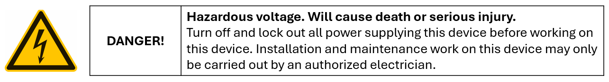
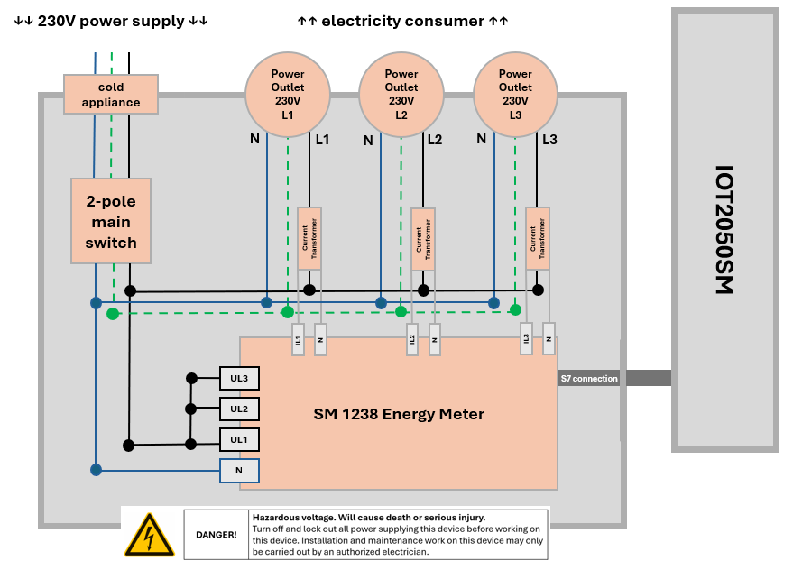
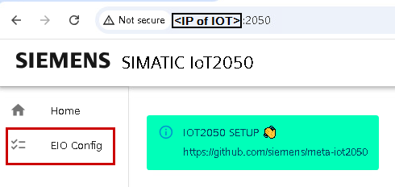
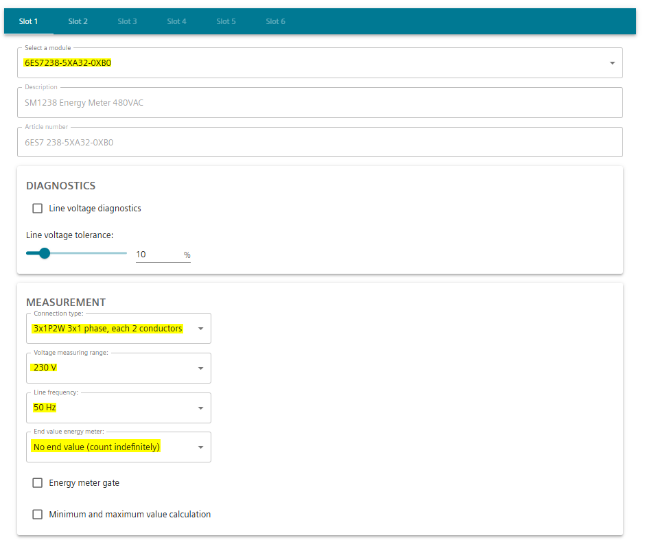
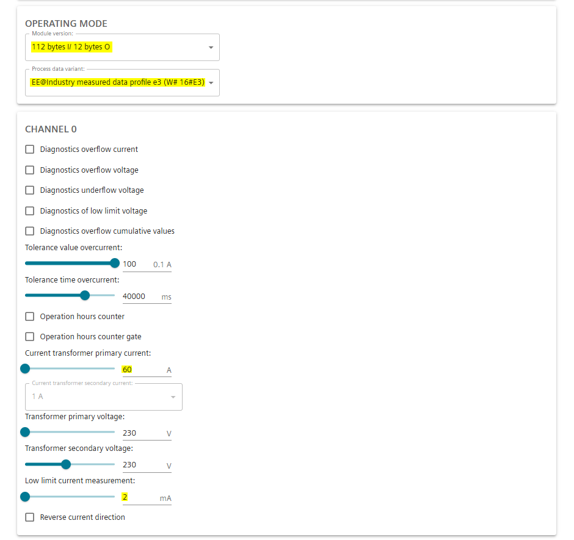
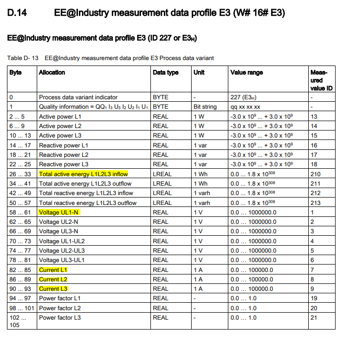
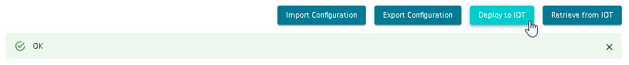
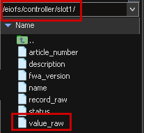

# **IOT2050 Setup & Connecting Energy Meter 1238**

- [**IOT2050 Setup \& Connecting Energy Meter 1238**](#iot2050-setup--connecting-energy-meter-1238)
  - [**Prepare the IOT2050**](#prepare-the-iot2050)
  - [**Hardware Setup IOT2050SM - Energy Meter 1238**](#hardware-setup-iot2050sm---energy-meter-1238)
    - [**Hardware connection between IOT2050SM and Energy Meter**](#hardware-connection-between-iot2050sm-and-energy-meter)
    - [**Hardware structure of the Distribution Box**](#hardware-structure-of-the-distribution-box)
      - [**Structure**](#structure)
      - [**Safety-Relevant Details**](#safety-relevant-details)
  - [**EIO Config via IOT2050SM WebUI**](#eio-config-via-iot2050sm-webui)

## **Prepare the IOT2050**

- Installing the SD-Card Example Image (minimum Example Image V1.4 is required!) -> in this example V01.04.04 is used
- First commissioning of the SIMATIC IOT2050: Remote access with Putty SSH Connection

You can find How-To-Guides in our **[SIMATIC IOT2050 Guide](https://sieportal.siemens.com/en-ww/support/forum/posts/IOT2050-Forum-Topics-Overview/332396)**.

## **Hardware Setup IOT2050SM - Energy Meter 1238**

### **Hardware connection between IOT2050SM and Energy Meter**

The IOT2050SM needs to be connected to the SM 1238 Energy Meter using the connection cable (included with the IOT2050SM).

### **Hardware structure of the Distribution Box**

**Please read the following points attentive:**

#### **Structure**

- **Input power**: The box is supplied with one phase (L) (230V AC), neutral conductor (N), and the protective earth conductor (PE).
- **Main Switch**: The main switch safely disconnects the phase and neutral conductor from the device.
- **Energy Meter**: Measures the energy consumption data of the electricity device.
- **Distribution**: The phase (L) is split internally between the terminals marked UL1, UL2, and UL3.
- **Power Sockets**: All power socket (L1; L2; L3) are supplied by the same phase (230V AC).
- **Current Transformers**: Each phase “L” (IL1:N / IL2:N / IL3:N) can be monitored separately for load measurement. **Not for phase difference measurement.**

#### **Safety-Relevant Details**

- **No Phase Shift**: A three-phase connection (400V) is NOT possible in this setup. Connecting three-phase devices may result in malfunction or damage.
- **Overload Protection**: Each phase “L” can be monitored for current, allowing overloads to be detected.
- Work on the device must only be carried out by a **qualified electrician!**

## **EIO Config via IOT2050SM WebUI**

On the Example Image V1.4 (used in this manual) an `EIO-configuration-interface` is already preinstalled and autostart is enabled. To access it, open a browser on your PC connected to the IOT2050 and open the URL `http://<IP of the IOT2050>:2050/`.

Configure the flow according to your needs. You can also use the example configuration of this application example: [config.yaml](../src/config.yaml) -> Click ``Import Configuration`` and select the example configuration.

> **Note:** The selcted ``current transformer primary current`` depends on the used curent transfomer. Int his case *3x ELEQ TQ30 60/1A current transformer*.

The selected process data variant ``EE@Industry measured data profile E3 (W# 16# E3)`` provides the following performance data:

The **following allocations** are relevant for this application example:

- ``total active energy L1L2L3 inflow`` [*x1Wh*]: energy consumption counter for L1, L2 and L3.
- ``voltage UL1-N`` [*x1V*]: As L1, L2 and L3 are split from only one phase in this example this parameter is representive for voltage UL2-N and UL3-N too.
- ``current L1-L2`` [*x1A*]: current / electric flow of the different lines.

For more detailed information have a look into the **[SM 1238 Energy Meter 480VAC Manual](https://cache.industry.siemens.com/dl/files/435/109483435/att_886111/v1/sm1238_energy_meter_480vac_manual_en-US_en-US.pdf)**.

If all settings have been made correctly, click on ``Deploy`` to apply the configuration to the IOT2050SM.

The performance energy data will then be stored in ``value_raw`` in the directory ``/eiofs/controller/slot1/``.

You finished the configuration of the Energy Meter 1238. The next step is **to adjust the [Node-Red Configuration](/docs/README_DataManagementNodeRed.md)**.
