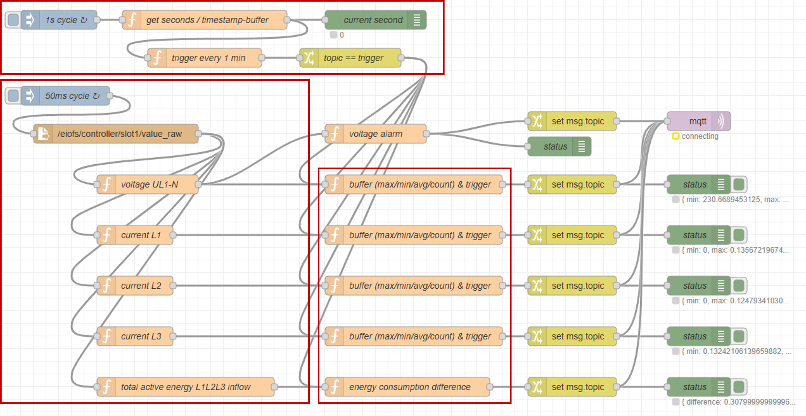

# **Node-Red Configuration**

- [**Node-Red Configuration**](#node-red-configuration)
  - [**Conection to system-time and time-based trigger for data pocessing**](#conection-to-system-time-and-time-based-trigger-for-data-pocessing)
  - [**Synchronized system-time to NTP**](#synchronized-system-time-to-ntp)
  - [**Read out Energy Meter 1238 energy performance data using Node-Red**](#read-out-energy-meter-1238-energy-performance-data-using-node-red)
  - [**Data Buffer and Forwarding via MQTT**](#data-buffer-and-forwarding-via-mqtt)

On the Example Image V1.4 (used in this manual) Node-Red is already preinstalled and autostart is enabled. To access it, open a browser on your PC connected to the IOT2050 and open the URL `http://<IP of the IOT2050>:1880/`.

The following illustrations show the complete Node-RED flow needed to read, store, pre-process and forward the data of the Energy Meter.



## **Conection to system-time and time-based trigger for data pocessing**


The first part of our flow will synchronize the flow with the system time of the IOT2050. For this purpose the seconds of the system time will read out by the function `get system-date seconds`:

```javascript
let now = new Date();
msg.payload = now.getSeconds();
```

The function `trigger every 1 min` will then wait until a full minute has elapsed:

```javascript
if (msg.payload === 0) {
    return msg;
```

In the area of energy management it is crucial to use a dedicated trigger. To archive this you should synchronize your application to an ntp-server (internet connection required). We recommend the following method:

## **Synchronized system-time to NTP**

Synchronize the system-time of the IOT2050 with a timer-server. Connect to your IOT2050 via SSH and adjust the file `/etc/systemd/timesyncd.conf` to your needs. In our example:

```ini
[Time]
NTP=de.pool.ntp.org
FallbackNTP=pool.ntp.org
RootDistanceMaxSec=5
PollIntervalMinSec=32
PollIntervalMaxSec=2048
ConnectionRetrySec=30
SaveIntervalSec=60
```

Save the file and open a terminal. It's also necessary to adjust your timezone correctly. In our case with `set-timezone Europe/Berlin` Now you can restart the timesync-service and check if it is correctly synchronized:

```bash
root@iot2050-debian:~# timedatectl set-timezone Europe/Berlin
root@iot2050-debian:~# sudo systemctl restart systemd-timesyncd
root@iot2050-debian:~# timedatectl status
               Local time: Tue 2025-07-01 10:54:21 CEST
           Universal time: Tue 2025-07-01 08:54:21 UTC
                 RTC time: Tue 2025-07-01 08:54:21
                Time zone: Europe/Berlin (CEST, +0200)
System clock synchronized: yes
              NTP service: active
          RTC in local TZ: no

```

## **Read out Energy Meter 1238 energy performance data using Node-Red**


The `read file node` is used to read the file `/eiofs/controller/slot1/value_raw` every 50ms and to transfer the content to a buffer-object-output. The following functions `voltage UL1-N`, `curent L1`, `curent L2`, `curent L3` and `total active energy L1L2L3 inflow` will then extract the relevant bytes and transform it into a Double-value. This is shown here as an example using `voltage UL1-N`:

```javascript
let bytes = [msg.payload[58], msg.payload[59], msg.payload[60], msg.payload[61]];

let buf = Buffer.from(bytes);
let value = buf.readFloatBE(0);

msg.payload = value;
msg.topic = "volUL1-N";

return msg;
```

As we can see in the process data profile overview in [EIO Config via IOT2050SM WebUI in Connecting Energy Meter](/docs/README_ConnectingEnergyMeter.md) byte 58-61 are relevant for the requested data.

|Byte|Allocation|
|---|---|
|26..33|Total active energy L1L2L3 inflow|
|58..61|Voltage UL1-N|
|82..85|Current L1|
|86..89|Current L2|
|90..93|Current L3|

## **Data Buffer and Forwarding via MQTT**


This part of the flow stores the incoming data into a data-buffer `let buffer`. After getting the trigger-signal it sends an array with `min`, `max`, `avg` and `count` (for the example funtion of `volUL1-N`).

```javascript
// Get current buffer
let buffer = context.get('buffer') || [];

// Check if new content or trigger
if (typeof msg.payload === "number" && msg.topic !== "trigger") {
    buffer.push(msg.payload);
    context.set('buffer', buffer);
    return null; // Noch nichts ausgeben
}

// Check after trigger
if (msg.topic === "trigger" && buffer.length > 0) {
    let min = Math.min(...buffer);
    let max = Math.max(...buffer);
    let avg = buffer.reduce((a, b) => a + b, 0) / buffer.length;
    // Reset Buffer
    context.set('buffer', []);
    // Forward data
    msg.payload = {
        min: min,
        max: max,
        avg: avg,
        count: buffer.length
    };
    return msg;
}

return null;
```

The `voltage alarm` additionally examines the incoming value for predefined upper and lower threshold values:

```javascript
// limits
let min = 229.5;
let max = 234.5;

// get current alarm-status from the context
let alarmState = flow.get('alarmState') || "normal";
let newState = alarmState;
let alarmMsg = null;

if (msg.payload < min) {
    if (alarmState !== "low") {
        // send alarm for lower limit exceeded
        alarmMsg = { payload: "lower limit exceeded", value: msg.payload };
        newState = "low";
    }
} else if (msg.payload > max) {
    if (alarmState !== "high") {
        // send alarm for upper limit exceeded
        alarmMsg = { payload: "upper limit exceeded", value: msg.payload };
        newState = "high";
    }
} else {
    if (alarmState !== "normal") {
        // send alarm for normal voltage
        alarmMsg = { payload: "voltage reached healthy state", value: msg.payload };
        newState = "normal";
    }
}

// Save new state
flow.set('alarmState', newState);

// Only issue a message when a state change occurred
return alarmMsg;
```

The output will then be tagged with a varabel topic which is used to publish it to the SCADA-system. For example `IOT2050/em1/voltage/data`. The values will then be published via MQTT using the `mqtt`-node.
