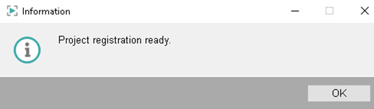

# **Data Management with WinCC OA**

- [**Data Management with WinCC OA**](#data-management-with-wincc-oa)
  - [**Overview \& Used Components**](#overview--used-components)
  - [**Preparation and Configuration of the WinCC OA project**](#preparation-and-configuration-of-the-wincc-oa-project)
  - [**MQTT connection**](#mqtt-connection)
  - [**Create Energy Meter device in SCADA**](#create-energy-meter-device-in-scada)
  - [**Data Decoding**](#data-decoding)

## **Overview & Used Components**

This document describes the installation and operation of an example project for recording energy data stored by a Node Red application on an IOT 2050 SM in any MQTT broker in the structure defined in the associated application example.

This part has been created with the following software components:

|Component|Article Number|
|-|-|
|WinCC OA - Server Basis|6AV6355-1AA50-0BA0|
|WinCC OA - 1k PowerTags|6AV6355-1AA50-0BB0|
|WinCC OA - 1 UI Client|6AV6355-1AA50-0CN0|
|WinCC OA - Para Standard|6AV6355-1AA50-0CH0|
|WinCC OA - Std. Protocol (Connectivity)|6AV6355-1AA50-0DN0|

This example will not describe all steps that are neccessary to install Winn CC OA and to create the project. **It is only intended to show by way of example how to proceed further with the data obtained and processed**.

**The used project is stored here: [UCC_PT_EnergyData.zip](../src/UCC_PT_EnergyData.zip).**

> To carry out the installation of WinCC OA, please follow the steps in the WinCC OA documentation. You can find the [documentation here](https://www.winccoa.com/documentation/WinCCOA/latest/en_US/Installation/INSTPVSS.html). The **Runtime Server installation option is sufficient** for this application

## **Preparation and Configuration of the WinCC OA project**

|No.|Action|
|-|-|
|1.|Unpack the supplied `ZIP-File UCC_PT_EnergyData.zip` into a folder.|
|2.|Start the ``WinCC OA Project Administrator`` and click on “Register project” Icon|
|||
|3.|Select the unzipped folder ``UCC_PT_EnergyData`` and press ``OK``|
|||
|4.|The project is now registered and can be started|
|||
|5.|In the ``WinCC OA Project Administrator`` select your created project ``UCC_PT_EnergyData`` and click on the ``Start project`` button|
|||

## **MQTT connection**

|No.|Action|
|-|-|
|1.|Open the ``MQTT Client configuration``|
|2.|Enter Connection Data (further information on the settings for the MQTT connection can be found in the [WinCC OA documentation](https://www.winccoa.com/documentation/WinCCOA/latest/en_US/Treiber_MQTT/mqtt_configuration.html))|
|3.|Activate Connection|
|4.|Press `Apply` or `OK`|
||The status of the connection is shown at the bottom of the screen. If the connection has been successfully established, you can continue with the next steps|
|||

## **Create Energy Meter device in SCADA**

In the table ``Topic Settings for new devices``, the MQTT items of the individual information have already been predefined based on the definitions in the ``Node-Red flow`` of the application example.

|No.|Action|
|-|-|
|1.|To create a new device in WinCC OA, enter any device name. The source topic is pre-assigned with ``IOT2050/`` according to the definition in this example. The device item for this example is per definition ``em1``.|
|2.|This configuration means that WinCC OA subscribes to the topic ``IOT250/em1/voltage/data`` for the ``voltage topic`` and stores the information it contains for the avergage, minimum and maximum on different tags. The timestamp is also taken from the payload of the topic.|
|||
|3.|After clicking on ``Create or update Device``, the device is created as a data point in WinCC OA and appears in the table. If the current tag data is older than one minute, the timestamp is displayed in red. New data arrives at the full minute and the time stamp is displayed in green.|
|||
|||
|4.|Clicking on a button to the right of the time stamp opens a screen and a trend for the respective energy meter.|
|||

## **Data Decoding**

The decoding of the information from the MQTT payload takes place in the CTRL script ``Energymeter.ctl``. In this example, the data of an energy meter is stored as data points of type ``em_Energymeter``.

In the first step the script will analyze if the payload contains a valid timestamp and if not it will be added from the current system-time:

```c
if (mappingHasKey(value, "timestamp"))
{
    timestamp = (float)value["timestamp"] / 1000;
    DebugFTN("emWORK", __FUNCTION__,"timestamp from device: ", timestamp, " aktuelle Zeit: " + (string)getCurrentTime());
}
else
{
    timestamp = getCurrentTime();
}
```

After this the script will search for the different tags `avg`, `min`, `max` and `difference` in the data-payload:

```c
if (mappingHasKey(value, "avg"))
    dpSetTimed(timestamp, baseStructName + ".avg", value["avg"]);

if (mappingHasKey(value, "min"))
    dpSetTimed(timestamp, baseStructName + ".min", value["min"]);

if (mappingHasKey(value, "max"))
    dpSetTimed(timestamp, baseStructName + ".max", value["max"]);

if (mappingHasKey(value, "difference"))
    dpSetTimed(timestamp, baseStructName + ".difference", value["difference"]);
```

You finished the IOT2050SM Energy Data Management Application Example. Have a look into [our SIMATICmeetsLinux repository](https://github.com/SIMATICmeetsLinux) for more application examples.
